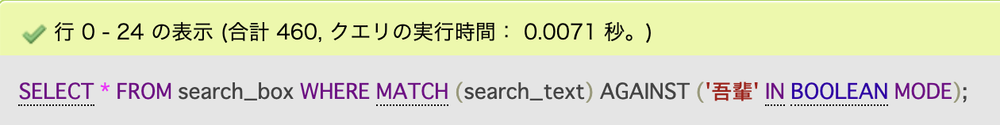
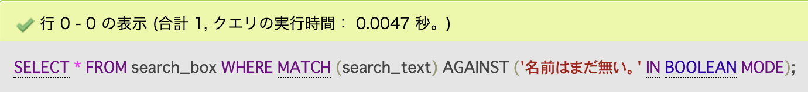
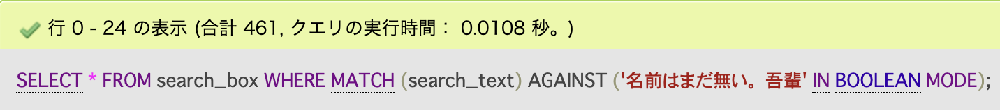

## 目的

LIKEを使用して、部分一致(%検索単語%)をするよりも全文検索の方が処理速度が高速だという情報を得たため、試してみました。<br>
テストデータは、夏目漱石の「吾輩は猫である」を句点区切りにしたデータを入れています。<br>
データ件数は、9115件で、文字数は、32万8000文字程度です。<br>
Dockerコンテナ立ち上げ時に自動でデータが入るので、興味ある方試してみて下さい。

---

## コンテナ立ち上げ
プロジェクト配下に移動し、以下のコマンドを実行することで立ち上がります。
```
docker-compose up -d
```

立ち上げた後、以下のリンク先にアクセスすることができます。<br>
[phpMyAdmin](http://localhost:8888/)

---

## 実行速度比較
**「吾輩」が含まれている文章を検索**<br>
<br>


**「名前はまだ無い。」が含まれている文章を検索**<br>
<br>


何度か実行することで多少ブレはあるものの上記のような結果になりました。<br>
短い単語の場合、LIKE検索の方が速く、<br>
長い文字列の場合、全文検索の方が速いという結果になりました。<br>

N-gramを使用しているため、バイグラムでの検索処理が影響しているのかもしれません。
<br><br>

**「名前はまだ無い。」もしくは「吾輩」が含まれている文章を検索**<br>
<br>


両方の単語を入れたOR検索の場合は、LIKE検索の方が速いという結果になりました。<br>
LIKE検索の実行結果が、検索条件が増えているにも関わらず"「名前はまだ無い。」が含まれている文章を検索"の実行速度よりも検索速度が速いのに違和感を覚えました。<br>
もしかしたらOR以降の吾輩の部分の速度のみが計測されたのではないかと思い、順番を入れ替えてみましたが、速度にあまり変化は見られませんでした。謎すぎる。<br>

---

## N-gramとは
「名前はまだ無い。」を検索する場合、「名前」「前は」「はま」「まだ」「だ無」「無い」「い。」のインデックスが作成され、インデックスとの合致数が多い場合に、検索結果にヒットする仕組みです。<br>
デフォルトでは、バイグラムであり、2文字に分割していますが、設定により変更することができます。<br>
注意点として、分割して作成したインデックスの文字数より短い単語を検索することができなくなります。<br>
デフォルトでは、2文字分割のため、1文字での検索が行えないということです。<br>

オプションをつけない場合には、IN NATURAL LANGUAGE MODEが適用され、類似性のあるものヒットします。<br>
LIKEでの部分一致と同じ動作にするためには、より厳格な検索を必要とするため、前述ではIN BOOLEAN MODEを使用しています。
